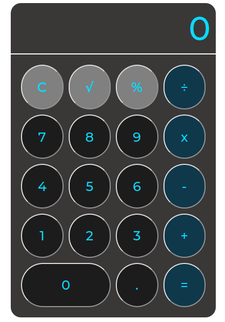

# JS-Calculator

Here is a basic calculator implemented using HTML, CSS and JavaScript. It utilises display grid to arrange buttons in the appropriate positions and display flex for responsiveness.

## Technologies Used:
* HTML
* CSS
* SCSS
* JavaScript

## Keyboard Shortcuts:
* **Digits**: Regular Numbers & Numpad Keys (0-9)
* **Decimal Point**: Period and NumpadDecimal Key
* **Calculate Answer**: Equals, Enter or NumpadEnter Key
* **Reset Calculator**: ESC Key
* **Add**: NumpadAdd Key
* **Subtract**: Minus or NumpadSubtract Key
* **Multiply**: NumpadMultiply Key
* **Divide**: Slash or NumpadDivide 
* **Percentage**: P
* **Square Root**: S
